# HƯỚNG DẪN SỬ DỤNG & ĐÀO TẠO VẬN HÀNH HỆ THỐNG CẤU HÌNH TÍNH ĐIỂM CVKD

Tài liệu này cung cấp toàn bộ kiến trúc, sơ đồ luồng hoạt động (flowcharts), quy tắc tính điểm và hướng dẫn chi tiết từng bước dành cho Quản lý, Chuyên viên Vận hành, Kế toán và Chuyên viên Kinh doanh (CVKD).

---

## MỤC LỤC

1. [Tổng Quan Hệ Thống](#1-tổng-quan-hệ-thống)
2. [Cấu Trúc Dữ Liệu & 3 Bảng Cấu Hình](#2-cấu-trúc-dữ-liệu--3-bảng-cấu-hình)
3. [Sơ Đồ Luồng Hoạt Động (Flowcharts)](#3-sơ-đồ-luồng-hoạt-động-flowcharts)
   - [3.1. Luồng Tính Điểm Tự Động Cho Giao Dịch (Calculation Engine Flow)](#31-luồng-tính-điểm-tự-động-cho-giao-dịch)
   - [3.2. Luồng Vận Hành Cấu Hình Trên Giao Diện Web UI](#32-luồng-vận-hành-cấu-hình-trên-giao-diện-web-ui)
   - [3.3. Luồng Tự Động Chuyển Tháng & Sao Chép Điểm](#33-luồng-tự-động-chuyển-tháng--sao-chép-điểm)
4. [Hướng Dẫn Thao Tác Chi Tiết (Step-by-Step Training)](#4-hướng-dẫn-thao-tác-chi-tiết)
   - [4.1. Mở Bảng Cấu Hình Điểm](#41-mở-bảng-cấu-hình-điểm)
   - [4.2. Quản Lý Điểm Quỹ NW (Bảng Tổng Hợp)](#42-quản-lý-điểm-quỹ-nw-bảng-tổng-hợp)
   - [4.3. Quản Lý Điểm Quỹ Chéo (Bảng Dự Án F2)](#43-quản-lý-điểm-quỹ-chéo-bảng-dự-án-f2)
   - [4.4. Quản Lý Điểm Chiến Dịch Đặc Biệt (Multi-Campaign)](#44-quản-lý-điểm-chiến-dịch-đặc-biệt-multi-campaign)
   - [4.5. Lưu Thay Đổi An Toàn](#45-lưu-thay-đổi-an-toàn)
   - [4.6. Kết Quả Đồng Bộ Sang Google Sheets Sau Khi Lưu](#46-kết-quả-đồng-bộ-sang-google-sheets-sau-khi-lưu)
5. [Cơ Chế Khớp & Thứ Tự Ưu Tiên Tính Điểm](#5-cơ-chế-khớp--thứ-tự-ưu-tiên-tính-điểm)
6. [Hệ Thống Trigger Tự Động & Menu Tiện Ích](#6-hệ-thống-trigger-tự-động--menu-tiện-ích)

---

## 1. TỔNG QUAN HỆ THỐNG

Hệ thống **Tính Điểm CVKD Tự Động** được thiết kế để thay thế toàn bộ công thức Excel lồng ghép thủ công phức tạp bằng một bộ máy tính điểm tự động tốc độ cao (Batch Calculation Engine), tích hợp giao diện cấu hình trực quan (Enterprise Web App) ngay trong Google Sheets.

### Lợi ích cốt lõi:
- **Tự động hóa 100%**: Điểm được tính ngay lập tức khi phát sinh giao dịch mới mà không cần kéo công thức.
- **Quản lý đa tháng linh hoạt**: Theo dõi lịch sử thay đổi điểm số theo từng tháng độc lập (ma trận điểm).
- **Hỗ trợ đa chiến dịch đồng thời (Multi-Campaign)**: Thiết lập các chiến dịch bán hàng ngắn hạn với thời gian và điều kiện áp dụng riêng biệt.
- **Không hardcode**: Người dùng quản trị có thể tự thêm dự án, sửa điều kiện, điều chỉnh điểm số mà không cần biết lập trình.

---

## 2. CẤU TRÚC DỮ LIỆU & 3 BẢNG CẤU HÌNH

Hệ thống phân tách rõ ràng dữ liệu phát sinh và cấu hình điểm thành các sheet chuyên biệt:

```
Google Spreadsheet
├── 📄 DATA                  --> Chứa toàn bộ giao dịch phát sinh (cần tính điểm)
├── 📄 Tổng hợp              --> Cấu hình điểm Quỹ NW (đa tháng + 3 tiêu chí khớp)
├── 📄 Dự án F2              --> Cấu hình điểm Quỹ Chéo (đa tháng)
└── 📄 Điểm chiến dịch       --> Cấu hình điểm các chiến dịch bán hàng đặc biệt
```

### Chi tiết 3 bảng cấu hình:

| Bảng Cấu Hình | Thuộc Sheet | Đối Tượng Áp Dụng | Tiêu Chí Khớp Điểm |
| :--- | :--- | :--- | :--- |
| **Bảng Tổng Hợp (Quỹ NW)** | `Tổng hợp` | Các giao dịch thuộc Quỹ NW (Cột Z = `Quỹ NW`) | Mã dự án + Tháng GD + 3 tiêu chí: Sản phẩm, Loại căn, Khoảng giá |
| **Dự Án F2 (Quỹ Chéo)** | `Dự án F2` | Các giao dịch quỹ chéo liên kết (Cột Z = `Quỹ chéo`) | Tên dự án F2 + Tháng giao dịch |
| **Điểm Chiến Dịch** | `Điểm chiến dịch` | Các giao dịch diễn ra trong đợt thi đua / sự kiện bán hàng | Ngày GD thuộc [Từ Ngày -> Đến Ngày] + Trạng thái `Đang chạy` + Khớp dự án & 3 tiêu chí |

---

> [!TIP]
> Toàn bộ quá trình điền, chỉnh sửa điểm và thiết lập điều kiện được thực hiện hoàn toàn trên giao diện trực quan **Web UI**. Khi bấm **Lưu Thay Đổi**, hệ thống sẽ tự động xuất và ghi dữ liệu chuẩn hóa sang 3 sheet trên Google Sheets. Xem hình ảnh cấu trúc chi tiết của từng sheet sau khi lưu tại [Mục 4.6: Kết Quả Đồng Bộ Sang Google Sheets Sau Khi Lưu](#46-kết-quả-đồng-bộ-sang-google-sheets-sau-khi-lưu).

---

## 3. SƠ ĐỒ LUỒNG HOẠT ĐỘNG (FLOWCHARTS)

### 3.1. Luồng Tính Điểm Tự Động Cho Giao Dịch

Sơ đồ thể hiện cách bộ máy tính điểm xử lý từng dòng dữ liệu trong sheet `DATA`:

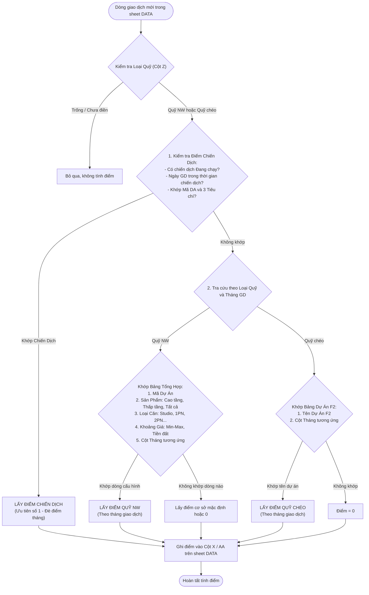

---

### 3.2. Luồng Vận Hành Cấu Hình Trên Giao Diện Web UI

Sơ đồ thao tác người dùng khi quản lý và chỉnh sửa điểm số:

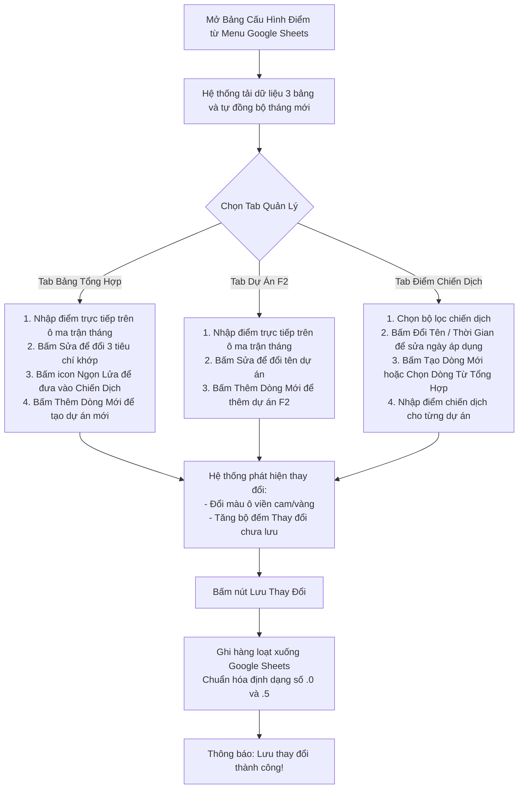

---

### 3.3. Luồng Tự Động Chuyển Tháng & Sao Chép Điểm

Hệ thống hoạt động hoàn toàn tự động khi bước sang chu kỳ tháng mới:

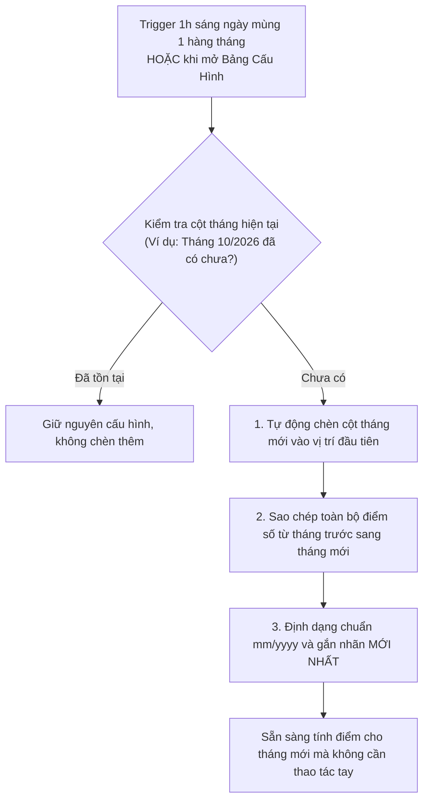

---

## 4. HƯỚNG DẪN THAO TÁC CHI TIẾT

### 4.1. Mở Bảng Cấu Hình Điểm
1. Trên thanh menu Google Sheets, nhấp vào mục **Cấu Hình Điểm**.
2. Chọn **Bảng Cấu Hình Điểm**.
3. Cửa sổ ứng dụng hiện đại sẽ hiển thị toàn màn hình với đầy đủ 3 Tab quản lý.

---

### 4.2. Quản Lý Điểm Quỹ NW (Bảng Tổng Hợp)

Tab **Bảng Tổng Hợp (Quỹ NW)** dùng để quản lý điểm cho các dự án nội bộ với điều kiện chi tiết:

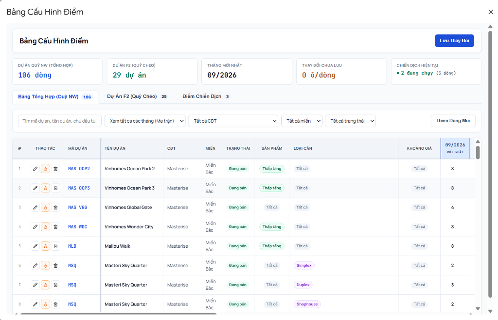

*Giao diện Bảng Tổng Hợp: Thẻ KPI tổng quan, thanh công cụ tìm kiếm/lọc đa tiêu chí, cột thao tác với icon SVG chuẩn enterprise và ma trận điểm theo tháng.*

#### a. Sửa điểm trực tiếp trên ma trận tháng:
- Nhấp trực tiếp vào ô điểm của tháng cần sửa (ví dụ: cột `09/2026 MỚI NHẤT`).
- Nhập số điểm mới (hỗ trợ số nguyên và số thập phân như `8`, `8.5`, `10.25`).
- Ô vừa sửa sẽ tự động đổi viền nổi bật để bạn dễ theo dõi.
- Sau khi nhập xong, bấm nút **Lưu Thay Đổi** ở góc trên cùng bên phải.

#### b. Thao tác trên từng dòng:
Ở cột **THAO TÁC** của mỗi dòng có 3 nút bấm SVG tinh gọn:
- **Nút Bút Chì**: Chỉnh sửa thông tin dự án và 3 tiêu chí khớp.
- **Nút Ngọn Lửa (Flame)**: Đưa dòng này vào **Chiến dịch bán hàng** chỉ với 1 click.
- **Nút Thùng Rác**: Xóa vĩnh viễn dòng cấu hình này.

#### c. Thêm dự án / điều kiện mới:
1. Nhấp nút **Thêm Dòng Mới** ở góc trên thanh công cụ.
2. Một cửa sổ modal thiết lập sẽ xuất hiện:

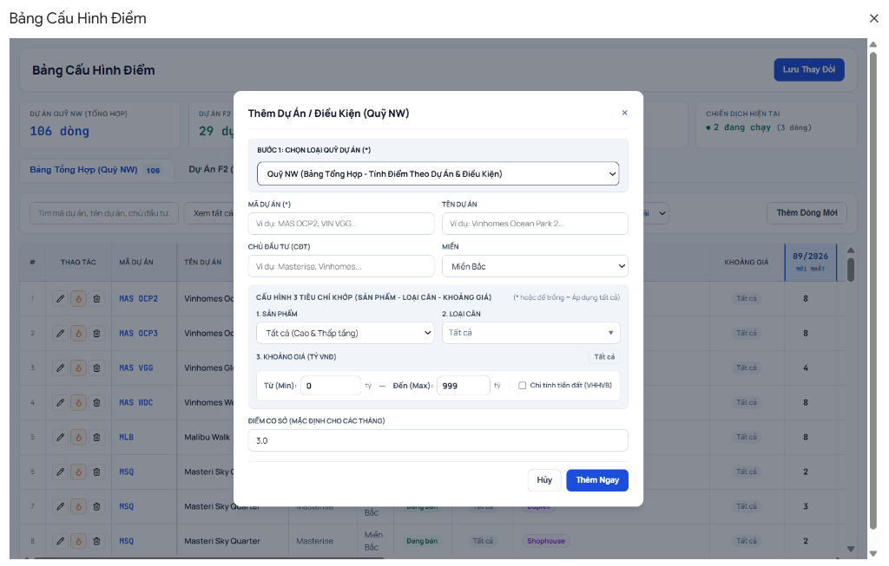

*Cửa sổ cấu hình dự án mới: Phân loại quỹ, mã/tên dự án, CĐT, vùng miền, cùng khối 3 tiêu chí khớp (Sản phẩm - Loại căn - Khoảng giá).*

3. Chọn loại quỹ: **Quỹ NW (Bảng Tổng Hợp)**.
4. Nhập **Mã dự án** (VD: `MAS OCP2`) và **Tên dự án** (VD: `Vinhomes Ocean Park 2`).
5. Chọn **Chủ đầu tư (CĐT)** và **Miền** (Bắc / Trung / Nam).
6. **Cấu hình 3 Tiêu Chí Khớp**:
   - **Sản phẩm**: Chọn `Tất cả (Cao & Thấp tầng)`, `Cao tầng`, hoặc `Thấp tầng`.
   - **Loại căn**: Chọn dropdown đa chọn (Studio, 1PN, 2PN, 3PN, Duplex, Penthouse, Shophouse...). Hỗ trợ tìm kiếm nhanh và chọn hàng loạt.
   - **Khoảng giá**: Nhập khoảng giá Min - Max (tỷ VNĐ). Nếu dự án chỉ áp dụng trên tiền đất, tích chọn **Chỉ tính tiền đất (VHHVB)**.
7. Nhập **Điểm Cơ Sở** ban đầu cho các tháng.
8. Bấm **Thêm Ngay**.

---

### 4.3. Quản Lý Điểm Quỹ Chéo (Bảng Dự Án F2)

Tab **Dự Án F2 (Quỹ Chéo)** quản lý điểm cho các dự án liên kết bán chéo:

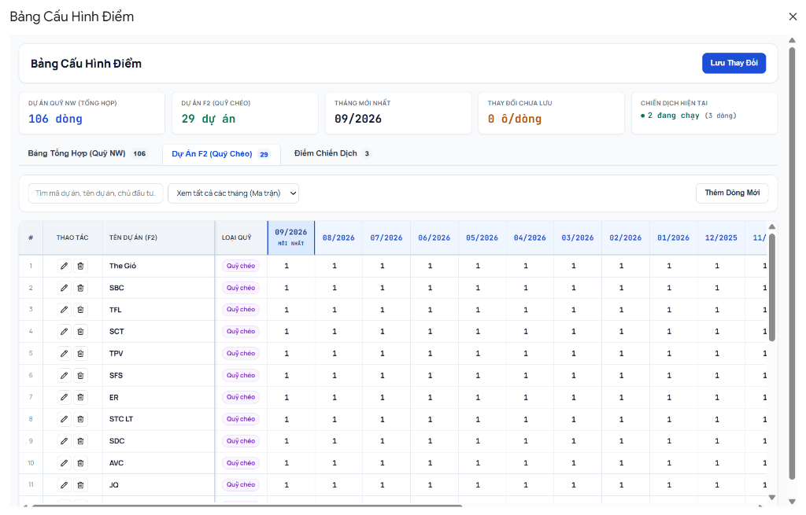

*Giao diện Bảng Dự Án F2: Quản lý ma trận điểm lịch sử qua các tháng (09/2026, 08/2026, 07/2026...) của từng dự án liên kết F2.*

1. Chuyển sang tab **Dự Án F2 (Quỹ Chéo)**.
2. Bạn có thể sửa điểm trực tiếp trên từng cột tháng tương tự Bảng Tổng Hợp.
3. Để thêm dự án F2 mới:
   - Bấm **Thêm Dòng Mới**.
   - Chọn loại quỹ: **Quỹ Chéo (Bảng Dự Án F2)**.
   - Nhập tên dự án (VD: `The Gió`, `Eaton Park`...).
   - Bấm **Thêm Ngay**.

---

### 4.4. Quản Lý Điểm Chiến Dịch Đặc Biệt (Multi-Campaign)

Tab **Điểm Chiến Dịch** cho phép bạn chạy nhiều chiến dịch thi đua cùng lúc (ví dụ: *Chiến dịch 1*, *Chiến dịch 2*, *Chiến dịch Bùng Nổ*):

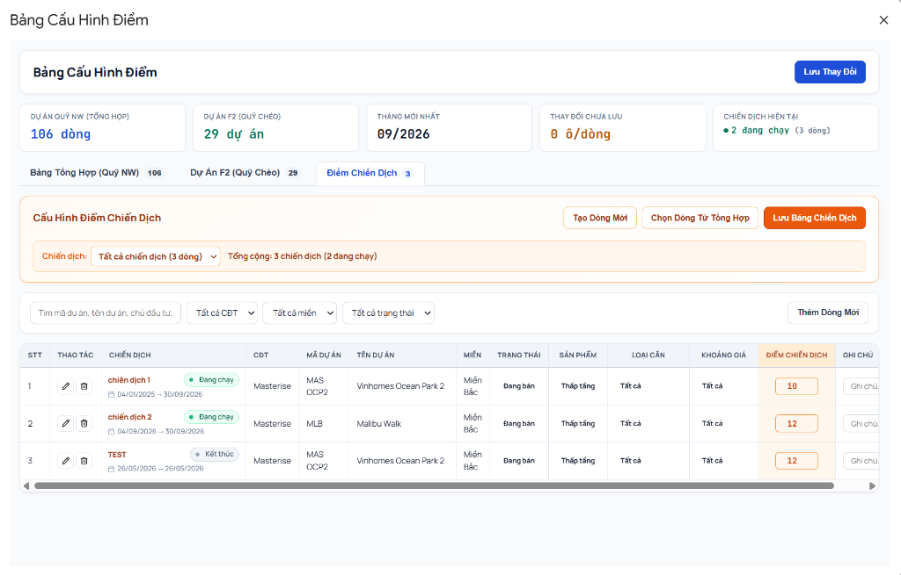

*Giao diện Điểm Chiến Dịch: Bảng điều khiển đa chiến dịch, theo dõi trạng thái bằng badge màu (Đang chạy / Kết thúc), khoảng thời gian áp dụng và mức điểm thi đua.*

#### a. Tạo chiến dịch mới:
1. Chuyển sang tab **Điểm Chiến Dịch**.
2. Nhấp nút **Tạo Dòng Mới**.
3. Tại khối **THÔNG TIN CHIẾN DỊCH ÁP DỤNG**:
   - Ô **Tên Chiến Dịch**: Nhập tên chiến dịch mới (VD: `Chiến dịch Thu Đông 2026`).
   - Ô **Từ Ngày** và **Đến Ngày**: Chọn khoảng thời gian chiến dịch có hiệu lực.
   - **Trạng thái**: Chọn `Đang chạy` hoặc `Tạm dừng`.
4. Điền Mã dự án, điều kiện khớp và mức **Điểm Chiến Dịch**.
5. Bấm **Thêm Ngay**.

#### b. Thêm nhanh dự án từ Bảng Tổng Hợp vào Chiến Dịch (Icon Ngọn Lửa):
- Tại Tab *Bảng Tổng Hợp*, bấm **Icon Ngọn Lửa (Flame)** ở dòng dự án muốn áp dụng:

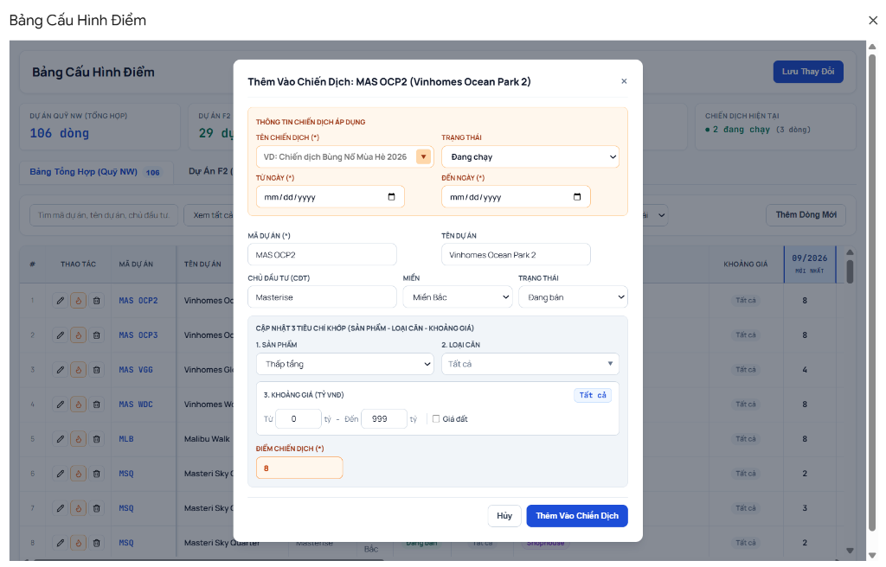

*Cửa sổ Thêm Vào Chiến Dịch: Tự động kế thừa toàn bộ tiêu chí (mã, tên, CĐT, miền, loại căn, khoảng giá). Người dùng chỉ cần chọn tên chiến dịch và mức điểm thưởng.*

- Cửa sổ modal sẽ tự động điền sẵn toàn bộ tiêu chí khớp của dự án đó.
- Bạn chọn tên chiến dịch (chọn chiến dịch đang chạy trong dropdown hoặc nhập tên mới), chọn ngày áp dụng và nhập **Điểm Chiến Dịch** $\rightarrow$ Bấm **Thêm Vào Chiến Dịch**.

#### c. Lọc và theo dõi chiến dịch:
- Dropdown **Chiến dịch** trên thanh điều khiển cho phép:
  - Xem riêng từng chiến dịch kèm thời gian và trạng thái chi tiết.
  - Chọn **Tất cả chiến dịch** để nhìn toàn cảnh tất cả các đợt thi đua đang có trong công ty.
- Badge trạng thái (`status-pill`):
  - Chấm xanh (`Đang chạy`): Chiến dịch đang có hiệu lực.
  - Chấm vàng (`Tạm dừng`): Tạm thời ngưng áp dụng điểm chiến dịch.
  - Chấm xám (`Kết thúc`): Đã quá ngày kết thúc, hệ thống tự động ngưng áp dụng.

#### d. Đổi tên, sửa ngày hoặc xóa chiến dịch:
- Bấm **Đổi Tên / Thời Gian** để cập nhật ngày bắt đầu, ngày kết thúc hoặc trạng thái.
- Bấm **Xóa Chiến Dịch** để xóa toàn bộ các dòng thuộc chiến dịch đang chọn.

---

### 4.5. Lưu Thay Đổi An Toàn

- Khi có bất kỳ ô điểm nào được sửa hoặc có dòng mới được thêm, huy hiệu số lượng thay đổi chưa lưu (`Thay đổi chưa lưu: X ô/dòng`) sẽ hiển thị trên KPI deck.
- Nút **Lưu Thay Đổi** ở góc phải sẽ chuyển sang trạng thái sẵn sàng.
- **Tính năng bảo vệ chống mất dữ liệu**: Nếu bạn vô tình đóng cửa sổ khi chưa lưu, một hộp thoại xác nhận sẽ hiện ra nhắc bạn lưu lại dữ liệu trước khi thoát.

---

### 4.6. Kết Quả Đồng Bộ Sang Google Sheets Sau Khi Lưu

Sau khi bạn hoàn tất việc điền/sửa điểm trên Web UI và bấm nút **Lưu Thay Đổi**, hệ thống backend sẽ tự động chuẩn hóa dữ liệu (làm tròn .0 / .5, kiểm tra trùng lặp) và ghi xuống 3 sheet Google Sheets tương ứng như sau:

#### 4.6.1. Sheet "Tổng hợp" (Quỹ NW)

Toàn bộ thông tin dự án, 3 tiêu chí khớp và điểm số từng tháng của Quỹ NW được lưu trữ dưới dạng ma trận:

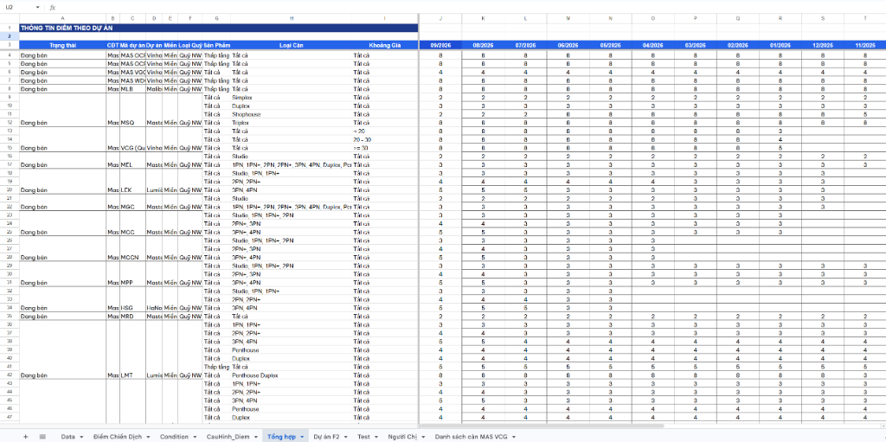

*Hình ảnh: Cấu trúc sheet "Tổng hợp" trên Google Sheets sau khi lưu - 9 cột thông tin cố định (từ Cột A đến Cột I) và các cột tháng điểm số từ Cột J trở đi.*

- **Dòng 1 - 2**: Tiêu đề banner `THÔNG TIN ĐIỂM THEO DỰ ÁN` và nhóm tiêu đề `Tháng`.
- **Dòng 3 (Header)**:
  - **Cột A (Trạng thái)**: Tình trạng bán của dự án (`Đang bán`, `Sold out`).
  - **Cột B (CĐT)**: Chủ đầu tư dự án (`Masterise`, `Vinhomes`...).
  - **Cột C (Mã dự án)**: Mã nhận diện dự án (`MAS OCP2`, `MAS VGG`, `MLB`...).
  - **Cột D (Dự án)**: Tên đầy đủ của dự án bất động sản.
  - **Cột E (Miền)**: Phân vùng địa lý (`Miền Bắc`, `Miền Nam`, `Miền Trung`).
  - **Cột F (Loại Quỹ)**: Luôn mang giá trị `Quỹ NW`.
  - **Cột G (Sản Phẩm)**: Phân loại hình bất động sản (`Thấp tầng`, `Cao tầng`, hoặc `Tất cả`).
  - **Cột H (Loại Căn)**: Phân loại căn hộ (`Studio`, `1PN`, `2PN`, `3PN`, `Duplex`, `Shophouse`, hoặc `Tất cả`).
  - **Cột I (Khoảng Giá)**: Khoảng giá tính theo tỷ VNĐ (`<= 20`, `20 - 30`, `>= 30`, hoặc `Tất cả`).
  - **Cột J trở đi (Ma trận tháng)**: Điểm số của từng tháng cụ thể (`09/2026`, `08/2026`, `07/2026`...). Cột tháng mới nhất luôn được tự động chèn ở vị trí Cột J.

---

#### 4.6.2. Sheet "Dự án F2" (Quỹ Chéo)

Điểm số của các dự án liên kết bán chéo được lưu trữ theo tên dự án và từng tháng giao dịch:

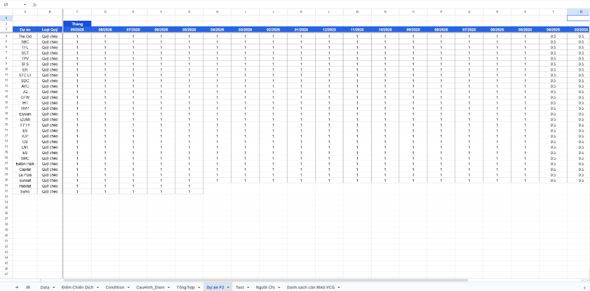

*Hình ảnh: Cấu trúc sheet "Dự án F2" trên Google Sheets sau khi lưu - 2 cột thông tin cố định và ma trận điểm qua các tháng.*

- **Dòng 2 - 3 (Header)**:
  - **Cột A (Dự án)**: Tên dự án F2 (`The Gió`, `SBC`, `TFL`, `SCT`, `TPV`, `SFS`, `ER`...).
  - **Cột B (Loại Quỹ)**: Luôn mang giá trị `Quỹ chéo`.
  - **Cột C trở đi (Ma trận tháng)**: Điểm số áp dụng cho dự án theo từng tháng giao dịch.

---

#### 4.6.3. Sheet "Điểm Chiến Dịch" (Multi-Campaign)

Toàn bộ các chiến dịch thi đua, thời gian hiệu lực và mức điểm thưởng thay thế được lưu trữ chi tiết:

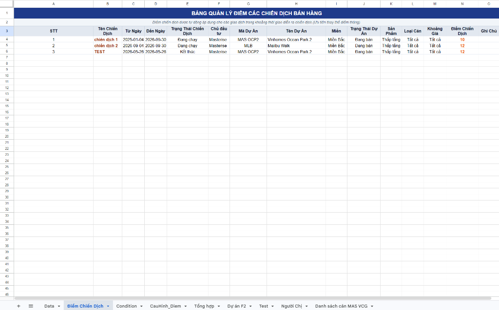

*Hình ảnh: Cấu trúc sheet "Điểm Chiến Dịch" trên Google Sheets sau khi lưu - Danh sách các dòng dự án áp dụng trong từng chiến dịch cụ thể.*

- **Dòng 1 - 2**: Banner `BẢNG QUẢN LÝ ĐIỂM CÁC CHIẾN DỊCH BÁN HÀNG` và phụ đề hướng dẫn.
- **Dòng 3 (Header)**:
  - **Cột A (STT)**: Số thứ tự cấu hình.
  - **Cột B (Tên Chiến Dịch)**: Tên chiến dịch áp dụng (`chiến dịch 1`, `chiến dịch 2`, `TEST`...).
  - **Cột C (Từ Ngày)**: Ngày bắt đầu có hiệu lực (định dạng `YYYY-MM-DD`).
  - **Cột D (Đến Ngày)**: Ngày kết thúc hiệu lực (định dạng `YYYY-MM-DD`).
  - **Cột E (Trạng Thái Chiến Dịch)**: `Đang chạy`, `Tạm dừng`, hoặc `Kết thúc`.
  - **Cột F - I**: Thông tin CĐT, Mã dự án, Tên dự án, Miền.
  - **Cột J**: Trạng thái dự án (`Đang bán`, `Sold out`).
  - **Cột K - M (3 Tiêu chí khớp)**: Sản Phẩm, Loại Căn, Khoảng Giá tương tự Bảng Tổng Hợp.
  - **Cột N (Điểm Chiến Dịch)**: Mức điểm áp dụng thay thế điểm tháng khi giao dịch khớp chiến dịch.
  - **Cột O (Ghi Chú)**: Ghi chú nội bộ cho dòng cấu hình.

---

## 5. CƠ CHẾ KHỚP & THỨ TỰ ƯU TIÊN TÍNH ĐIỂM

Khi tính điểm cho một giao dịch trong sheet `DATA`, hệ thống duyệt theo thứ tự ưu tiên từ trên xuống dưới:

```
Ưu Tiên 1: ĐIỂM CHIẾN DỊCH (Nếu giao dịch nằm trong thời gian chiến dịch đang chạy)
    └── Khớp: Mã DA + Sản Phẩm + Loại Căn + Khoảng Giá
         └── Nếu KHỚP: Lấy điểm chiến dịch (BỎ QUA điểm tháng)

Ưu Tiên 2: ĐIỂM THÁNG QUỸ NW (Bảng Tổng Hợp)
    └── Khớp: Mã DA + Tháng giao dịch + 3 Tiêu Chí Khớp:
         ├── Tiêu chí 1 (Sản phẩm): Khớp chính xác hoặc '*' (Tất cả)
         ├── Tiêu chí 2 (Loại căn): Chuỗi loại căn chứa loại căn GD hoặc '*' (Tất cả)
         └── Tiêu chí 3 (Khoảng giá): Giá GD nằm trong [Min, Max]. Nếu chọn giá đất, so khớp theo cột giá đất.
              └── Quy tắc độ sâu: Dòng nào có điều kiện chi tiết hơn sẽ được ưu tiên trước dòng chung chung (*).

Ưu Tiên 3: ĐIỂM THÁNG QUỸ CHÉO (Bảng Dự Án F2)
    └── Khớp: Tên dự án F2 (tự động chuẩn hóa chữ hoa/thường, loại bỏ khoảng trắng thừa) + Tháng giao dịch.
```

> **Lưu ý**: Ký tự `*` hoặc chữ `Tất cả` đại diện cho giá trị đại diện (Wildcard), nghĩa là áp dụng cho mọi sản phẩm / loại căn / khoảng giá.

---

## 6. HỆ THỐNG TRIGGER TỰ ĐỘNG & MENU TIỆN ÍCH

### 6.1. Tự Động Hóa 100% (Không cần bấm thủ công)
1. **Trigger On-Edit (Ngay lập tức)**:
   - Khi bạn nhập hoặc dán dòng dữ liệu mới vào sheet `DATA`, hệ thống nhận diện và tính điểm tức thì cho dòng đó.
2. **Trigger Hàng Ngày (Chạy lúc 1:00 AM)**:
   - Mỗi đêm, hệ thống kiểm tra chu kỳ tháng. Nếu bước sang tháng mới, hệ thống tự động chèn cột tháng và sao chép điểm từ tháng trước sang.

### 6.2. Menu Tiện Ích Trên Thanh Công Cụ Google Sheets

Hệ thống tích hợp sẵn menu **Cấu Hình Điểm** trực tiếp trên thanh công cụ của Google Sheets, giúp bạn kích hoạt nhanh các giao diện và tác vụ tính toán khi cần thao tác đột xuất:

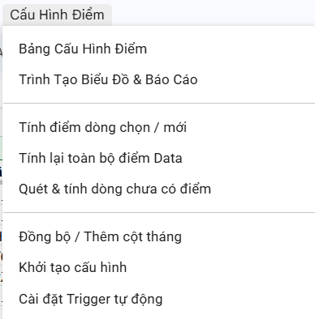

*Menu Cấu Hình Điểm: Cung cấp đầy đủ các lối tắt mở giao diện, công cụ tính điểm thủ công và các tiện ích quản trị hệ thống.*

#### Chi tiết các mục trong Menu:

| Nhóm Chức Năng | Tên Mục | Tác Vụ Thực Hiện |
| :--- | :--- | :--- |
| **Giao diện Web App** | **Bảng Cấu Hình Điểm** | Mở ứng dụng Web UI quản trị ma trận điểm đa tháng, dự án F2 và điểm chiến dịch. |
| | **Trình Tạo Biểu Đồ & Báo Cáo** | Mở công cụ vẽ biểu đồ phân tích trực quan hóa dữ liệu theo dự án, nhân sự, phòng ban. |
| **Tính toán theo yêu cầu** | **Tính điểm dòng chọn / mới** | Chỉ quét và tính điểm cho các dòng đang được bôi đen bằng chuột trong sheet `DATA`. |
| | **Tính lại toàn bộ điểm Data** | Quét và tính lại điểm hàng loạt cho toàn bộ hơn 5.000 dòng dữ liệu từ đầu đến cuối. |
| | **Quét & tính dòng chưa có điểm** | Tự động dò tìm các dòng dữ liệu mà cột điểm đang còn trống để tính bù điểm nhanh chóng. |
| **Tiện ích Quản trị viên** | **Đồng bộ / Thêm cột tháng** | Kiểm tra và chèn thêm cột tháng mới (nếu chưa có) kèm sao chép điểm từ tháng trước. |
| | **Cài đặt Trigger tự động** | Kiểm tra và tái thiết lập hệ thống trigger tự động chạy ngầm (Trigger On-Edit & Trigger Hàng Ngày). |

---
*Tài liệu được cập nhật tự động theo phiên bản Enterprise UI v2.0.*

